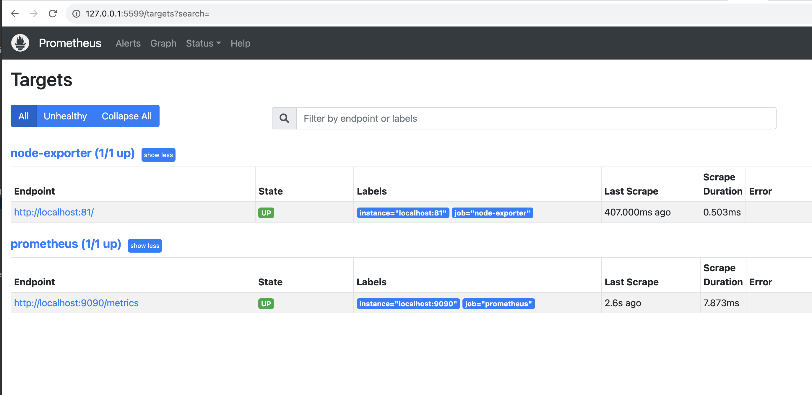
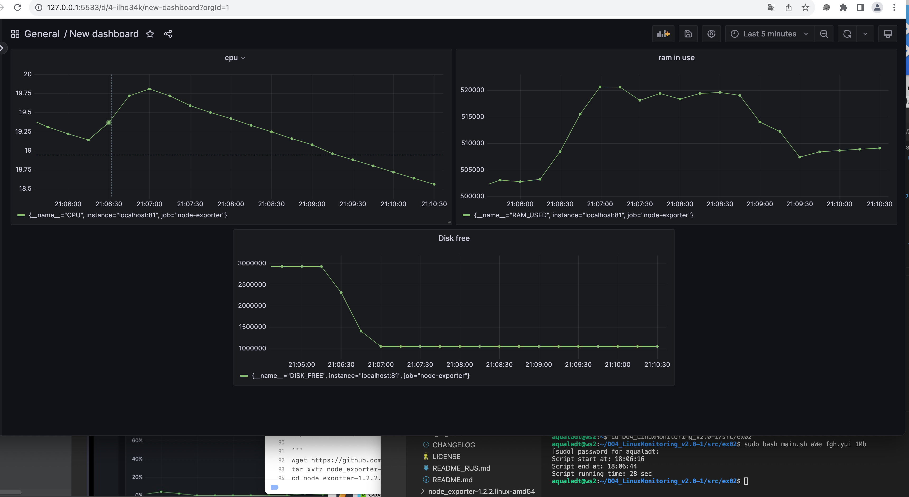
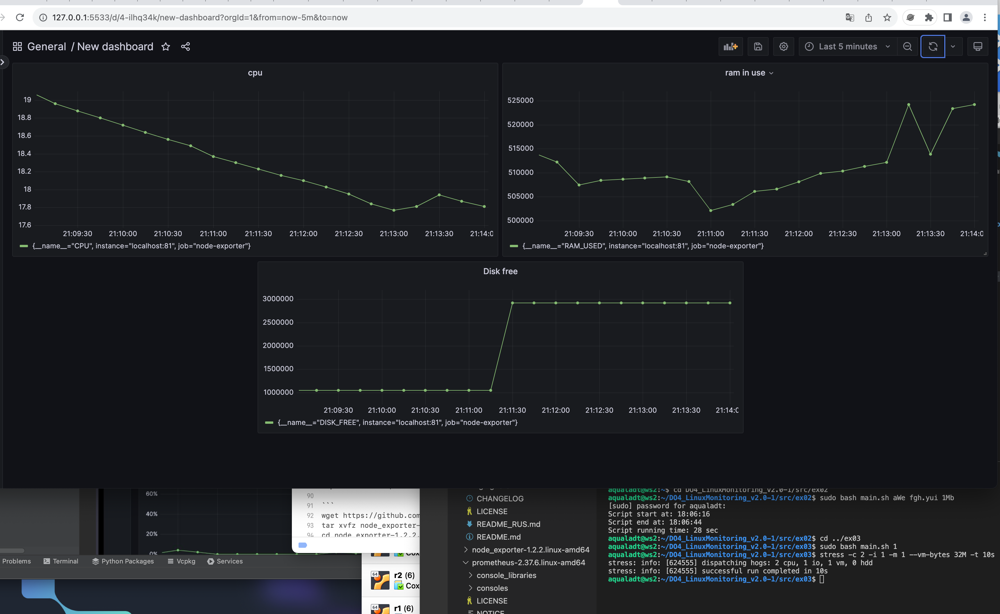

### Поменять конфигурационный файл Prometheus, чтобы он собирал информацию с созданной вами странички.

### Запустить ваш bash-скрипт из Части 2 и посмотреть на нагрузку жесткого диска (место на диске и операции чтения/записи)

### Установить утилиту stress и запустить команду stress -c 2 -i 1 -m 1 --vm-bytes 32M -t 10s
### Посмотреть на нагрузку жесткого диска, оперативной памяти и ЦПУ

